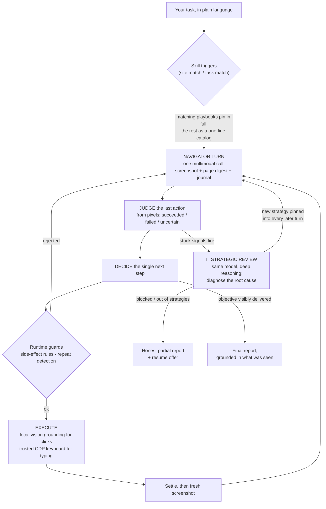
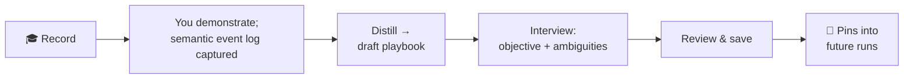

# Browser Use

**A browser agent that sees, judges, and learns how *you* do things.**

Browser Use is a Chrome extension. You type a task into its side panel in plain language — *"find 5 second-degree decision makers in Melbourne on LinkedIn and copy their details into a Google Sheet"* — and it drives your real, logged-in browser to deliver it: navigating, clicking, typing, reading, and checking its own work from screenshots at every step.

It is built around three ideas:

1. **Judge, don't assume.** After every action the agent looks at an actual screenshot and rules whether the action worked — success is something it must *see*, never something it predicts.
2. **Safety lives in code, not prompts.** Anything irreversible (posting, deleting, purchasing) is guarded by the runtime itself: one attempt, no blind retries, honest stops.
3. **Knowledge is taught, not hardcoded.** The agent carries *skills* — small playbooks of site knowledge — and you can teach it new ones by simply demonstrating a task while it watches.

A typical task costs **$0.002–$0.04** in model calls and takes seconds to a few minutes.

---

## Using it

### Give it a task

Open the side panel, type what you want. The agent decides whether the request even needs the browser (a plain question gets a plain answer). For browser tasks you watch a live trace of everything it does — each line is one real event:

| Trace line | Meaning |
|---|---|
| `Step 3: type 5 line(s) into the focused editor` | The action it chose, with its one-line reason |
| `Step 3 ✓ — The sheet now shows five names in A1:A5…` | Its judgment of that action, read off the screenshot |
| `📘 Site playbooks in force: google-sheets, linkedin` | Which skills are pinned into its thinking right now |
| `🧭 Strategy: Stop clicking UI filters. Use a search URL…` | A strategic review fired and set new standing orders |
| `🛡 Native dialog accepted: "Leave site?"…` | The harness auto-handled a browser popup that would otherwise freeze the run |
| `☁ xiaomi/mimo-v2.5 · $0.0005 · 4s` | Exactly what each decision cost and how long it took |

Nothing is hidden and nothing is cropped — the trace is the debugging surface.

### When it finishes (or can't)

The final answer reports only what was **proven on screen**. If a run gets stuck, it doesn't flail: deterministic stuck-detectors trigger a deeper *strategic review* that diagnoses the root cause and charts a different route. If three reviews can't crack it, the run stops honestly with everything it did gather, and you can reply `continue` to resume — the agent re-plans against the live page with all its collected knowledge intact.

### Teach it a skill

Press the 🎓 button and just **do the task yourself** while the agent watches:

1. **Record** — perform the task by hand. The extension captures a *semantic event log*: "clicked the Post button inside the composer", "typed X into the Search field" — described in the same vocabulary the agent uses to act. Not video, not a DOM recording. Passwords are always masked. Type notes anytime ("this filter is paywalled — skip it").
2. **Distill** — on Finish, a model turns your demonstration into a draft playbook: the canonical route, the traps, what screens should look like.
3. **Interview** — the agent asks you 1–3 pointed questions, always starting with the key one: *what should this skill accomplish, and when should I use it?* Your answer becomes the playbook's first line.
4. **Save** — the skill is live immediately. Next time a task or site matches, you'll see it in the `📘` line.

Skills are also fully editable by hand (Options → Site playbooks), and shareable as plain JSON files via Export/Import.

### What a skill actually is

A skill is **advice, not a macro**. It's a short playbook pinned into the agent's prompt when relevant:

```
Find top-performing new Solana tokens on birdeye.so.
Start at https://birdeye.so/ and sort by 24h change.
Never use the search box for discovery — the trending list is the reliable route.
```

The agent still judges every step against the live page — if the site changed since you taught it, **the screen wins over the note**. That property is what makes taught skills safe: a stale or even wrong skill can cost a few wasted steps, never a wrong irreversible action.

Skills surface at two levels: playbooks whose site or task-pattern matches are pinned **in full**; every other skill appears as a **one-line catalog entry** (name, sites, purpose) in every decision — so the agent always knows what you've taught it and can choose to route through your preferred site instead of improvising.

---

## How it works



**One turn = one multimodal model call.** The navigator receives a screenshot of the live tab, a compact page digest, the run journal, and any pinned playbooks. In a single reply it *judges* what the previous action actually did (from the pixels, as evidence) and *decides* the next step. There is no upfront multi-step plan to go stale — verification **is** the first half of every decision.

**Two tiers of thinking.** The per-step loop is deliberately fast, cheap, and myopic (a few seconds and a fraction of a cent per turn). When deterministic stuck-signals fire — the same action judged failed twice, repeated no-effect actions, pacing loops, or the navigator flagging itself — a **strategic review** runs with deep reasoning: it reads the whole journal, diagnoses the root cause (*"that filter is paywalled — stop fighting it, encode the constraint in the search URL"*), and pins an **active strategy** into every subsequent turn.

**Division of labor.** Local models (via Ollama) are the *senses*: a vision grounding model resolves "the Post button inside the composer" to coordinates, and a small local model bulk-reads pages. The cloud navigator makes every *decision*. Deterministic code is the *conductor*: budgets, guards, dialog handling, typing mechanics.

**Teaching flow:**



---

## Design choices — and the failures that paid for them

Every rule below was bought with a real failed run, not invented in advance.

**Judge-and-decide replaced plan-and-verify.** Earlier versions planned many steps ahead with formal postconditions ("after this step, expect the composer to be gone"). Nearly every failure was in the *expectation machinery* — predictions about pages the model hadn't seen yet — while the browser actions themselves were fine. Judging outcomes *after the fact from a screenshot* eliminated the whole failure class: nothing is predicted, everything is observed.

**Success must be provable only by success.** A submit step is never verified by the text you just typed still being on screen (it was there before the click, too). Proof is a *transition* only success produces: the "Your post was sent" toast, the item appearing in the feed, the dialog closing.

**Side effects get exactly one attempt — in code.** Posting, sending, deleting, purchasing: the runtime gives such steps a single attempt and permanently refuses a blind re-issue on the same page while the outcome is unconfirmed. A false "it failed" must never cause a duplicate post; the agent is instructed to go *look* for the result instead of doing it again.

**Runs end for reasons, never from exhaustion theater.** Stuck-detection is deterministic; reviews are bounded (three per run); when they're spent and the run is stuck again, it stops and reports honestly — including anything it *did* deliver — rather than burning twenty more steps flailing. And the final report may only describe what the journal shows was actually written and seen on screen, never a wish.

**Skills are priors, not scripts.** A replayable macro rots the day the site ships a redesign, and it would bypass the judge — reintroducing blind execution. As advice, a skill can be slightly stale and still valuable, because reality always outranks it. This is also why teaching is safe by construction.

**Teaching records meaning, not pixels.** The demonstration log stores *actions in the agent's own vocabulary* — the same descriptions it uses to act — so nothing is lost translating "what you did" into "what the agent should know". A three-minute demo is a few kilobytes of JSON, trivially reviewable and redactable before anything is saved.

**The browser is full of things a page-level agent cannot touch.** Native dialogs (`Leave site?`, `alert`, `confirm`) don't exist in the DOM, can't be clicked synthetically, and freeze the page's JavaScript while open — a run can go completely blind. The harness handles them at the browser (debugger) level and journals what it did. Same doctrine as typing into canvas editors like Google Docs and Sheets: real trusted key events through the Chrome DevTools Protocol, with human-like pacing — synthetic DOM events are ignored by exactly the apps that matter.

**Honest cost accounting, visible always.** Every decision line in the trace carries its model, dollar cost, and latency; the final line totals the run. Cheap is a feature: the benchmark tasks (LinkedIn→Sheet, post-and-delete on X, Hacker News→Google Doc) each delivered for under five cents.

---

## Privacy

- **Local senses, cloud judgment.** Perception, click grounding, and bulk page reading run locally via Ollama. The cloud navigator receives screenshots of the active tab plus compact page digests — and every cloud call requests **no-data-retention routing** (providers that neither train on nor store prompts).
- **Teaching** captures no screenshots in the saved skill; password fields are masked at the moment of capture; you review everything before saving.
- **No credentials, ever.** The agent never logs in or handles passwords — if a login wall appears, it stops and tells you.
- A fully local mode (no API key) exists: screenshots never leave the machine, at reduced capability.

## Status

Research prototype under active development. The three-task benchmark (structured data collection into a spreadsheet, irreversible social posting with cleanup, content research into a document) has been delivered end-to-end. On the roadmap: semantic skill retrieval as libraries grow, multi-site workflow skills, voice narration for teaching, and skill sharing beyond JSON files.
